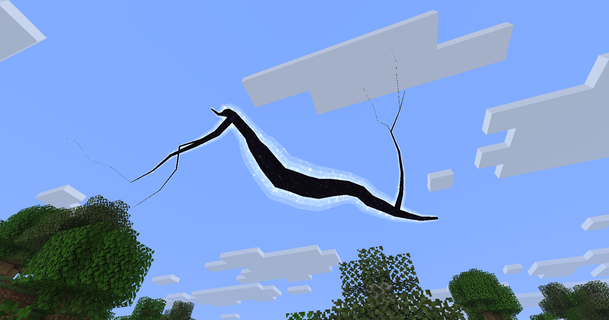

# Branching Rift

The branching rift is a variant of the [Rift](./rift.md). It uses multiple overlapping polycones to create branches.



For a fixed `Seed`, the sample is growth-stable:

- increasing `BranchCount` adds one deterministic new branch at a time
- increasing `Volume` grows the existing trunk/branches (they become chonky!) without changing the underlying branch skeleton
- increasing `SkeletonSize` changes the underlying branch skeleton length/shape scale
- later branches can attach to earlier branches, so higher counts naturally introduce sub-branches
- each branch has its own delayed growth scale, so later branches can stay thinner until `Volume` increases further

## Registry id

`magicparticleslib:branching_rift`

## Command usage

You can spawn a branching rift with vanilla `/summon`:

```mcfunction
/summon magicparticleslib:branching_rift ~ ~ ~ {Seed:123,SkeletonSize:24,Volume:1.0f,VisualIntensity:0.8f,BranchCount:3,Jaggedness:1.0f,Taper:0.6f}
```

## NBT fields

- `Seed`: controls the generated shape seed
- `SkeletonSize`: controls the branch/trunk skeleton scale
- `Volume`: controls branch thickness and per-branch growth
- `VisualIntensity`: controls visual brightness/intensity
- `BranchCount`: controls how many branches are generated
- `Jaggedness`: controls how sharply branches bend
- `Taper`: controls how quickly branches narrow

## Notes

- `BranchCount`: values `<= 0` produce only the trunk
- `Jaggedness`: recommended starting range is around `0.0..2.0`
- `Taper`: recommended starting range is around `0.0..1.0`
- `Volume`: larger values thicken the branches 
- `SkeletonSize`: larger values change the underlying branch skeleton itself

## Example variants

Sparse, smoother branching:

```mcfunction
/summon magicparticleslib:branching_rift ~ ~ ~ {Seed:42,SkeletonSize:18,Volume:0.8f,VisualIntensity:0.6f,BranchCount:2,Jaggedness:0.35f,Taper:0.35f}
```

Same skeleton, more growth volume:

```mcfunction
/summon magicparticleslib:branching_rift ~ ~ ~ {Seed:42,SkeletonSize:18,Volume:1.8f,VisualIntensity:0.6f,BranchCount:2,Jaggedness:0.35f,Taper:0.35f}
```

Chaotic, high-branch sample:

```mcfunction
/summon magicparticleslib:branching_rift ~ ~ ~ {Seed:777,SkeletonSize:36,Volume:2.1f,VisualIntensity:1.1f,BranchCount:6,Jaggedness:1.8f,Taper:0.85f}
```
