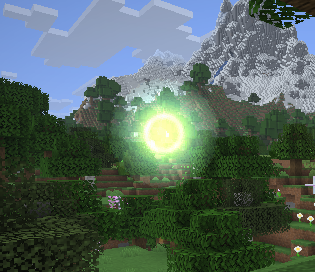

# Aura Node Particle

The aura node particle is a stationary, camera-facing composite of swirling strand clouds around a small animated core. It is fully data-driven: every appearance is described by an **aura node preset** registered to the `magicparticleslib:aura_node_preset` registry, so other mods can add their own node types and textures without touching library code. They aim to re-create the "Aura Node" effect from Thaumcraft 4. Not all types of Nodes from Thaumcraft have been implemented, just a representative set. Others can be added by mod author using this library via the presets by supplying fitting textures (and settings).

To achieve the effect of Thaumcraft where nodes are only fully visible with the Thaumometer (or Goggles), additional logic must be added to determine which particle system to spawn when. For now only the "Node Visible" effect is available in MPL. The "Node Default" effect (without Thaumometer) may be added in the future.



## Registry id

`magicparticleslib:aura_node`

## How the system works (brief)

- **Presets.** Each preset is a plain data record (see [Preset parameters](#preset-parameters)) that points at sprite strips in the particle atlas and defines the strand colors and core rendering. Presets are registered through the `magicparticleslib:aura_node_preset` registry ([`AuraNodePresets`](../../src/main/java/com/klikli_dev/magicparticleslib/premade/particle/auranode/AuraNodePresets.java), `DeferredRegister` + `NewRegistryEvent`).
- **Spawn / network.** A node particle is spawned from an [`AuraNodeParticleOptions`](../../src/main/java/com/klikli_dev/magicparticleslib/premade/particle/auranode/AuraNodeParticleOptions.java), which carries only the preset id plus an optional tint color, scale, and lifetime. The client resolves the id to a preset at spawn time; unknown ids fall back to the `normal` preset, so preset contents can evolve without breaking compatibility.
- **Rendering.** The particle reads its preset and looks up sprite frames by name from the particle atlas. Each 32-frame strip is played at 20 fps. Strands use an independently designed motion model (see [Strands](#strands)) that combines counter-rotation with two breathing waves. The core is rendered from the preset's strip at `coreScaleMultiplier ×` its pulsing base scale, either additively or with normal blending, and can rotate independently through `coreRotates`. The effect remains opaque through 34 blocks and then fades smoothly to transparent at 54 blocks.
- **Atlas registration (datagen).** [`MagicParticlesLibParticleDescriptionProvider`](../../src/main/java/com/klikli_dev/magicparticleslib/datagen/MagicParticlesLibParticleDescriptionProvider.java) iterates the registry and lists every preset's core strip and strand strip in the particle description file, so their frames get stitched into the particle atlas automatically.

## Strands

The strands are the swirling, glowing clouds around the core. Each strand is a single camera-facing quad positioned at the node, tinted with one entry of the preset's `strandColors` and textured with the shared `strandTexture` strip; all strands animate through the same frame as the core.

### How many strands a node has

The number of strands **is** the number of entries in the preset's `strandColors` list. There is no separate strand-count or amount field. Adding or removing `StrandColor` entries adds or removes strands, and `preset.strandColors().size()` reports the configured count. All shipped presets use four.

A non-white payload `color` ignores the preset palette and tints the preset's configured number of strands with that color; only a white payload (the default) uses the preset's own `strandColors`.

### Configuring a strand

Each `StrandColor` entry has two fields:

- `color` — the ARGB tint of the strand quad.
- `additive` — the blend mode: additive strands (`SRC_ALPHA`, `ONE`) glow, while normal-blend strands (`SRC_ALPHA`, `ONE_MINUS_SRC_ALPHA`) composite darkly and receive a modest opacity boost.

All strands of a node share one `strandTexture` strip; only the tint and blend mode differ per strand. Give a node its own strip by overriding `strandTexture` in the preset.

### Per-strand motion

Strand motion is driven in code, not configured per preset. Each particle receives a random starting phase so nearby nodes do not move in lockstep:

- Strands begin evenly distributed around a full turn. Even-numbered strands rotate clockwise and odd-numbered strands rotate counter-clockwise.
- Every strand has a slightly different angular speed, producing revolutions of roughly 29–43 seconds for the four shipped strands without a shared repeating sequence.
- The half-size combines a per-strand primary wave with a slower secondary wave, varying around `0.57·scale` and staying approximately between `0.385·scale` and `0.755·scale`.
- Per-strand opacity is normalized by the square root of the strand count, which keeps larger custom palettes visible without making the complete node disproportionately bright.

The core has its own subtle size pulse and rotation rate; it does not derive either value from a strand. Set `coreRotates` to false to keep it fixed (see [Preset parameters](#preset-parameters)).

## Implementation overview

Relevant classes (all in `premade/particle/auranode/`):

- [`AuraNodePreset`](../../src/main/java/com/klikli_dev/magicparticleslib/premade/particle/auranode/AuraNodePreset.java) - the preset record with all visual parameters
- [`AuraNodePresets`](../../src/main/java/com/klikli_dev/magicparticleslib/premade/particle/auranode/AuraNodePresets.java) - the preset registry and shipped presets
- [`AuraNodeParticleOptions`](../../src/main/java/com/klikli_dev/magicparticleslib/premade/particle/auranode/AuraNodeParticleOptions.java) - spawn payload record
- [`AuraNodeParticleType`](../../src/main/java/com/klikli_dev/magicparticleslib/premade/particle/auranode/AuraNodeParticleType.java) - the registered particle type
- [`AuraNodeParticleProvider`](../../src/main/java/com/klikli_dev/magicparticleslib/premade/particle/auranode/AuraNodeParticleProvider.java) - client provider
- [`AuraNodeParticle`](../../src/main/java/com/klikli_dev/magicparticleslib/premade/particle/auranode/AuraNodeParticle.java) - the client particle
- [`AuraNodeParticleGroup`](../../src/main/java/com/klikli_dev/magicparticleslib/premade/particle/auranode/AuraNodeParticleGroup.java) - the particle group
- [`AuraNodeRenderState`](../../src/main/java/com/klikli_dev/magicparticleslib/premade/particle/auranode/AuraNodeRenderState.java) - billboard submission, split by blend mode

Rendering goes through a dedicated particle group plus two custom render pipelines in [`RenderTypeRegistry`](../../src/main/java/com/klikli_dev/magicparticleslib/registry/RenderTypeRegistry.java), both reusing the vanilla `core/particle` shader:

- the aura node pipeline blends additively (`SRC_ALPHA`, `ONE`)
- the aura node normal-blend pipeline blends translucently (`SRC_ALPHA`, `ONE_MINUS_SRC_ALPHA`)

Each preset's strands can individually pick either blend mode (`StrandColor.additive`), and the core picks one through `coreBlendAdditive`.

## Preset parameters

Each preset is a record with the following fields:

| Field | Type | Meaning |
| --- | --- | --- |
| `texture` | `Identifier` (string) | Particle atlas location of the node core sprite strip, e.g. `magicparticleslib:aura_node/normal`. |
| `strandTexture` | `Identifier` (string, optional) | Particle atlas location of the rotating strand sprite strip. Defaults to `magicparticleslib:aura_node/strand`. |
| `strandColors` | array of `{ color, additive }` | One entry per rendered strand. `color` is an ARGB int; `additive` selects additive vs. normal blending for that strand. |
| `coreBlendAdditive` | `boolean` | Whether the core is rendered additively (`true`) or with normal alpha blending (`false`). |
| `coreScaleMultiplier` | `float` | Core scale multiplier (the hungry preset uses `0.8` to render its core smaller). |
| `coreRotates` | `boolean` | Whether the core slowly rotates (the unstable preset keeps its core fixed with `false`). |

A sprite strip is the base path of 32 animation frames. Frames live at `{strip}_{NN}` with zero-padded two-digit numbers, e.g. `magicparticleslib:aura_node/normal_00` … `magicparticleslib:aura_node/normal_31` (the preset `texture`/`strandTexture` values are the strip base, not the frame locations).

## Current presets

The library ships six presets. Their strand palettes are ARGB colors followed by the blend mode (`A` = additive, `N` = normal); the `strand` strip is shared across all of them:

| Preset id | Strands | Core blend | Core scale | Core rotates |
| --- | --- | --- | --- | --- |
| `magicparticleslib:normal` | `0xFFF4E38A A`, `0xFFEF7135 A`, `0xFF70B94D A`, `0xFF5CC7E8 A` | additive | 1.0 | yes |
| `magicparticleslib:dark` | `0xFF292533 A`, `0xFF4B4654 N`, `0xFF7D667F A`, `0xFF46502B A` | normal | 1.0 | yes |
| `magicparticleslib:hungry` | `0xFF8F2228 A`, `0xFFD4A84F A`, `0xFFEA7040 A`, `0xFF4A4145 N` | additive | 0.8 | yes |
| `magicparticleslib:pure` | `0xFFCBCFE6 A`, `0xFFF2E890 A`, `0xFFEDE1A4 A`, `0xFF72C6DC A` | additive | 1.0 | yes |
| `magicparticleslib:tainted` | `0xFF742A82 A`, `0xFF8D3BA7 A`, `0xFF30263A A`, `0xFF77707D N` | normal | 1.0 | yes |
| `magicparticleslib:unstable` | `0xFFA9E8EA A`, `0xFFC8EFF2 A`, `0xFFE9834E A`, `0xFF51505D N` | additive | 1.0 | no |

The definitions live in [`AuraNodePresets`](../../src/main/java/com/klikli_dev/magicparticleslib/premade/particle/auranode/AuraNodePresets.java). The `strand` strip plus the six core strips (`strand`, `normal`, `dark`, `hungry`, `pure`, `tainted`, `unstable`) ship with the library under `assets/magicparticleslib/textures/particle/aura_node/`.

## Particle Options

`AuraNodeParticleOptions` controls the appearance of the effect.

| Field | Type | Default | Description |
|---|---|---|---|
| `preset` | `Identifier` | required | Registry id of the preset to render, e.g. `magicparticleslib:hungry` |
| `color` | `int` / ARGB color codec | `0xFFFFFFFF` | Tint color; a white payload uses the preset's own strand palette, any other color replaces all strands |
| `scale` | `float` | `1.0f` | Overall effect scale |
| `lifetime` | `int` | `72000` | Lifetime in ticks |

Use `AuraNodeParticleOptions.of(preset)` for the most common case, or `AuraNodeParticleOptions.of(preset, color, scale, lifetime)` for full control. `preset` is a `DeferredHolder<AuraNodePreset, AuraNodePreset>` (e.g. `AuraNodePresets.HUNGRY`) or any other value from the `aura_node_preset` registry.

## Behavior

The particle:

- stays exactly where it is spawned (it has no motion)
- renders the preset's strand clouds with alternating rotation directions and layered breathing, plus a small independently pulsing core on top
- animates its core and strands through their 32 sprite frames (full cycle 1.6 s)
- remains fully visible through 34 blocks, then fades smoothly to transparent at 54 blocks
- renders fullbright, unaffected by world light level

## Use in Code

```java
AuraNodeParticleOptions options = AuraNodeParticleOptions.of(AuraNodePresets.HUNGRY);
level.addParticle(options, 10.0D, 65.0D, 10.0D, 0.0D, 0.0D, 0.0D);
```

A tinted, scaled variant with a custom lifetime:

```java
AuraNodeParticleOptions options = AuraNodeParticleOptions.of(AuraNodePresets.NORMAL, 0xFFB84D, 1.5F, 600);
```

There is also an example client helper command wired in through [`SpawnAuraNodeClientCommand`](../../src/main/java/com/klikli_dev/magicparticleslib/example/command/SpawnAuraNodeClientCommand.java).

## Adding additional node types

Add your own node type with your own textures in three steps:

1. **Create a texture strip.** Make 32 PNG frames of 64×64 named `{your_mod}:particle/aura_node/{type}_{00..31}.png` (the frame files on disk; their atlas locations are `{your_mod}:aura_node/{type}_00` …). The `strand` strip is shared by default — override `strandTexture` if your node needs a different one.
2. **Register a preset** bound to the `magicparticleslib:aura_node_preset` registry:

   ```java
   public static final ResourceKey<Registry<AuraNodePreset>> KEY = ResourceKey.createRegistryKey(
           Identifier.fromNamespaceAndPath("magicparticleslib", "aura_node_preset"));
   public static final DeferredRegister<AuraNodePreset> PRESETS = DeferredRegister.create(KEY, "your_mod");

   static {
       PRESETS.register("your_type", () -> new AuraNodePreset(
               Identifier.fromNamespaceAndPath("your_mod", "aura_node/your_type"),
               AuraNodePreset.DEFAULT_STRAND_TEXTURE,
               List.of(
                       new AuraNodePreset.StrandColor(0xFFFFFFFF, true),
                       new AuraNodePreset.StrandColor(0xFF404040, false)),
               true,
               1.0F,
               true));
   }
   ```

   Register the `DeferredRegister` on your mod event bus and create the registry once via `NewRegistryEvent` (see `AuraNodePresets.createRegistry`).
3. **Ship the PNGs.** The MPL datagen automatically lists every registered preset's `texture` and `strandTexture` strips in the particle description file, so your frames are stitched into the particle atlas with no extra work.

## Persistent Sources (e.g. a block)

An aura node particle has a finite `lifetime` (default `72000` ticks) and is removed from its particle group once it expires. A persistent effect such as a block therefore has to keep respawning the particle. Each spawn chooses a new motion and animation phase, so replacing a long-lived node may slightly vary its movement while retaining the same preset appearance.

The simplest approach is a timed respawn on the client, mirroring the pattern described for the nitor particle.

No direct interaction with the group is needed: `ParticleEngine` routes the spawned `AuraNodeParticle` into `AuraNodeParticleGroup` automatically (via its `getGroup()` render type), the group removes it again once it dies, and rendering happens through the group's `extractRenderState`.

## Command usage

Example direct particle command:

```mcfunction
/particle magicparticleslib:aura_node{preset:"magicparticleslib:hungry",color:-1,scale:1.0f,lifetime:72000} ~ ~1 ~ 0 0 0 0 1
```

Example helper command for easier local testing:

```mcfunction
/mpl spawn aura_node
```

Helper command parameters (all optional):

- `pos`: world position, spawns at `pos` instead of in front of the player
- `preset`: registry id of the preset (tab-completes from the registry), defaults to `magicparticleslib:normal`
- `color`: packed ARGB color, defaults to `-1` (`0xFFFFFFFF`)
- `scale`: effect scale, range `0.05f` and up
- `lifetime`: lifetime in ticks, range `1` and up, defaults to `72000`
