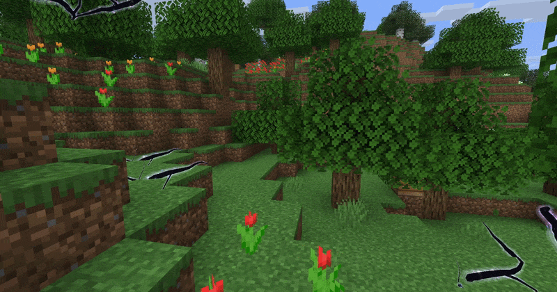

# Electric Arc Particle

The electric arc particle is a particle that renders a jagged "electric" arc between two points.



## Registry id

`magicparticleslib:electric_arc`

## Implementation overview

Relevant classes:

- [`ElectricArcParticleOptions`](../../src/main/java/com/klikli_dev/magicparticleslib/premade/particle/electricarc/ElectricArcParticleOptions.java)
- [`ElectricArcParticleType`](../../src/main/java/com/klikli_dev/magicparticleslib/premade/particle/electricarc/ElectricArcParticleType.java)
- [`ElectricArcParticleProvider`](../../src/main/java/com/klikli_dev/magicparticleslib/premade/particle/electricarc/ElectricArcParticleProvider.java)
- [`ElectricArcParticle`](../../src/main/java/com/klikli_dev/magicparticleslib/premade/particle/electricarc/ElectricArcParticle.java)
- [`ElectricArcParticleGroup`](../../src/main/java/com/klikli_dev/magicparticleslib/premade/particle/electricarc/ElectricArcParticleGroup.java)

Unlike sprite-set particles such as glow, electric arc is registered as a special particle provider and rendered through a dedicated particle group plus custom render pipelines in [`RenderTypeRegistry`](../../src/main/java/com/klikli_dev/magicparticleslib/registry/RenderTypeRegistry.java).

## Particle Options

`ElectricArcParticleOptions` defines the arc endpoint and a few rendering controls.

| Field | Type | Default | Description |
|---|---|---:|---|
| `target` | `Vec3` | `Vec3.ZERO` | World-space endpoint the arc bends toward |
| `color` | `int` / RGB color codec | required | Packed arc color |
| `width` | `float` | `1.0f` | Overall arc thickness |
| `seed` | `int` | `0` | Random seed used to keep the arc shape stable per spawn |
| `lifetime` | `int` | `3` | Lifetime in ticks |

Use `ElectricArcParticleOptions.of(target, color)` for the most common case, or construct the record directly when you want custom width, seed, or lifetime. Source position is determined by the particle spawn position, not the options.

## Behavior

The particle:

- creates a jagged polycone path between the spawn position and `target`
- uses separate halo and core meshes for a brighter center
- fades alpha over its lifetime
- keeps the same overall shape for a given `seed`
- uses a particle group.

## Use in Code

See https://docs.neoforged.net/docs/resources/client/particles/#spawning-particles.  
Example:

```java
Vec3 target = new Vec3(10.0, 65.0, 10.0);
ElectricArcParticleOptions options = new ElectricArcParticleOptions(target, 0xB891FF, 0.6F, level.random.nextInt(), 3);
```

There is also an example client helper command wired in through [`SpawnElectricArcClientCommand`](../../src/main/java/com/klikli_dev/magicparticleslib/example/command/SpawnElectricArcClientCommand.java) and [`ElectricArcTestHelper`](../../src/main/java/com/klikli_dev/magicparticleslib/example/electricarc/ElectricArcTestHelper.java).

## Command usage

Example direct particle command:

```mcfunction
/particle magicparticleslib:electric_arc{target:[10.0d,65.0d,10.0d],color:12030463,width:0.6f,seed:1234,lifetime:3} ~ ~1 ~ 0 0 0 0 1
```

Note: because the particle command does not accept relative coordinates in target, this would fly towards the absolute position (10, 65, 10) in the world, not a position relative to the command source. 

Example helper command for easier local testing:

```mcfunction
/mpl spawn electric_arc 100 4
```

Helper command parameters:

- `durationTicks`: how long the held-item simulation runs in ticks
- `tickSpacing`: how many ticks to wait between individual arc spawns

So `/mpl spawn electric_arc 100 4` simulates holding the test item for about 100 ticks, spawning one arc every 4 ticks.
