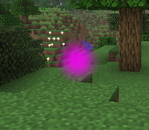

# Glow Particle

The glow particle is a premade translucent particle with full-bright rendering, configurable ARGB color, optional no-depth rendering, and optional shrinking over its lifetime.



## Registry id

`magicparticleslib:glow`

## Implementation overview

Relevant classes:

- [`GlowParticleOptions`](../../src/main/java/com/klikli_dev/magicparticleslib/premade/glow/GlowParticleOptions.java)
- [`GlowParticleType`](../../src/main/java/com/klikli_dev/magicparticleslib/premade/glow/GlowParticleType.java)
- [`GlowParticleProvider`](../../src/main/java/com/klikli_dev/magicparticleslib/premade/glow/GlowParticleProvider.java)
- [`GlowParticle`](../../src/main/java/com/klikli_dev/magicparticleslib/premade/glow/GlowParticle.java)

Particle description datagen is done in [`MagicParticlesLibParticleDescriptionProvider`](../../src/main/java/com/klikli_dev/magicparticleslib/datagen/MagicParticlesLibParticleDescriptionProvider.java).

## Particle Options

`GlowParticleOptions` uses a packed ARGB color similar to vanilla `ColorParticleOption`, plus a few particle-specific fields.

| Field | Type | Default | Description                              |
|---|---|---:|------------------------------------------|
| `color` | `int` / ARGB color codec | `#FFFFFFFF` | Packed particle color including alpha    |
| `disableDepthTest` | `boolean` | `false` | Uses a no-depth translucent render layer |
| `shrinkWithAge` | `boolean` | `true` | Shrinks size linearly over lifetime      |
| `size` | `float` | `0.25f` | Initial quad size                        |
| `age` | `int` | `36` | Lifetime in ticks                        |

Helper methods are exposed on `GlowParticleOptions` for constructing options in code.

## Behavior

The particle:

- is full-bright
- is translucent
- fades alpha linearly over its lifetime
- can optionally shrink linearly over its lifetime
- rotates over time
- uses a sprite-set based particle description
- can optionally disable depth writes/testing behavior for overlapping translucent visuals

## Use in Code 

See https://docs.neoforged.net/docs/resources/client/particles/#spawning-particles.   
Use `GlowParticleOptions` with the methods described there.

## Command usage

Example with shrinking enabled:

```mcfunction
/particle magicparticleslib:glow{color:-65281,disableDepthTest:0b,shrinkWithAge:1b,size:0.25f,age:36} ~ ~1 ~ 0 0 0 0 1
```

Example with constant size:

```mcfunction
/particle magicparticleslib:glow{color:-2130706433,disableDepthTest:0b,shrinkWithAge:0b,size:0.4f,age:60} ~ ~1 ~ 0 0 0 0 1
```

Use integer ARGB values in commands.

`color` uses ARGB format internally:

- `#AARRGGBB`
- `#FFFF00FF` = opaque magenta
- `#80FFFFFF` = 50% alpha white

Equivalent command-safe integer examples:

- `-65281` = `#FFFF00FF`
- `-2130706433` = `#80FFFFFF`