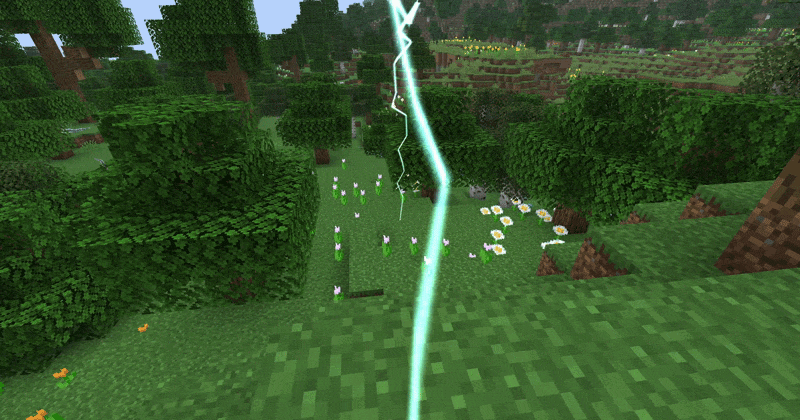

# Lightning Particle

The lightning particle is a particle that renders a jagged arcing lightning beam between two points.



## Registry id

`magicparticleslib:lightning`

## Implementation overview

Relevant classes:

- [`LightningParticleOptions`](../../src/main/java/com/klikli_dev/magicparticleslib/premade/particle/lightning/LightningParticleOptions.java)
- [`LightningParticleType`](../../src/main/java/com/klikli_dev/magicparticleslib/premade/particle/lightning/LightningParticleType.java)
- [`LightningParticleProvider`](../../src/main/java/com/klikli_dev/magicparticleslib/premade/particle/lightning/LightningParticleProvider.java)
- [`LightningParticle`](../../src/main/java/com/klikli_dev/magicparticleslib/premade/particle/lightning/LightningParticle.java)
- [`LightningParticleGroup`](../../src/main/java/com/klikli_dev/magicparticleslib/premade/particle/lightning/LightningParticleGroup.java)

Unlike sprite-set particles such as glow, lightning is registered as a special particle provider and rendered through a dedicated particle group plus custom render pipelines in [`RenderTypeRegistry`](../../src/main/java/com/klikli_dev/magicparticleslib/registry/RenderTypeRegistry.java).

## Particle Options

`LightningParticleOptions` defines the beam endpoint and a few rendering controls.

| Field | Type | Default | Description |
|---|---|---:|---|
| `target` | `Vec3` | `Vec3.ZERO` | World-space endpoint the lightning travels toward |
| `color` | `int` / RGB color codec | required | Packed lightning color |
| `height_gain` | `float` | `0.5f` | Upward arc bias used when building the ballistic centerline |
| `width` | `float` | `0.75f` | Overall ribbon thickness |
| `seed` | `int` | `0` | Random seed used to keep the lightning shape stable per spawn |
| `lifetime` | `int` | `4` | Lifetime in ticks |

Use `LightningParticleOptions.of(target, color)` for the most common case, or construct the record directly when you want custom height gain, width, seed, or lifetime. Source position is determined by the particle spawn position, not the options.

## Behavior

The particle:

- creates a jagged upwards-arcing path between the spawn position and `target`
- builds the lightning path once per spawn, then fades it over its lifetime
- renders two crossed ribbon meshes
- keeps the same overall shape for a given `seed`
- uses a particle group

## Use in Code

See https://docs.neoforged.net/docs/resources/client/particles/#spawning-particles.  
Example:

```java
Vec3 target = new Vec3(10.0, 65.0, 10.0);
LightningParticleOptions options = new LightningParticleOptions(target, 0x88FBFF, 0.48F, 0.72F, level.random.nextInt(), 4);
```

There is also an example client helper command wired in through [`SpawnLightningClientCommand`](../../src/main/java/com/klikli_dev/magicparticleslib/example/command/SpawnLightningClientCommand.java) and [`LightningTestHelper`](../../src/main/java/com/klikli_dev/magicparticleslib/example/lightning/LightningTestHelper.java).

## Command usage

Example direct particle command:

```mcfunction
/particle magicparticleslib:lightning{target:[10.0d,65.0d,10.0d],color:8979455,height_gain:0.48f,width:0.72f,seed:1234,lifetime:4} ~ ~1 ~ 0 0 0 0 1
```

Note: because the particle command does not accept relative coordinates in target, this would fly towards the absolute position (10, 65, 10) in the world, not a position relative to the command source. 

Example helper command for easier local testing:

```mcfunction
/mpl spawn lightning 70 3
```

Helper command parameters:

- `durationTicks`: how long the held-item simulation runs in ticks
- `tickSpacing`: how many ticks to wait between individual lightning spawns

So `/mpl spawn lightning 70 3` simulates holding the test item for about 70 ticks, spawning one lightning beam every 3 ticks.
