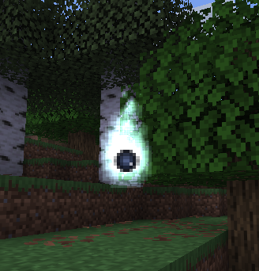

# Nitor Particle

The nitor particle is a stationary, procedural flame-like light source. It renders an additive flame of shimmering motes around a translucent core, plus smaller motes that keep rising upward over time.



## Registry id

`magicparticleslib:nitor`

## Implementation overview

Relevant classes:

- [`NitorParticleOptions`](../../src/main/java/com/klikli_dev/magicparticleslib/premade/particle/nitor/NitorParticleOptions.java)
- [`NitorParticleType`](../../src/main/java/com/klikli_dev/magicparticleslib/premade/particle/nitor/NitorParticleType.java)
- [`NitorParticleProvider`](../../src/main/java/com/klikli_dev/magicparticleslib/premade/particle/nitor/NitorParticleProvider.java)
- [`NitorParticle`](../../src/main/java/com/klikli_dev/magicparticleslib/premade/particle/nitor/NitorParticle.java)
- [`NitorParticleGroup`](../../src/main/java/com/klikli_dev/magicparticleslib/premade/particle/nitor/NitorParticleGroup.java)
- [`NitorRenderState`](../../src/main/java/com/klikli_dev/magicparticleslib/premade/particle/nitor/NitorRenderState.java)

The nitor is registered as a sprite-set particle, so the particle description provider generates its sprite list from the textures in `assets/magicparticleslib/textures/particle/`:

- `nitor_flame.png` - the flame texture used for the additive flame motes
- `nitor_core.png` - the light core texture
- `nitor_core_dark.png` - the dark core texture

Rendering goes through a dedicated particle group plus two custom render pipelines in [`RenderTypeRegistry`](../../src/main/java/com/klikli_dev/magicparticleslib/registry/RenderTypeRegistry.java), both reusing the vanilla `core/particle` shader:

- the flame pipeline blends additively (`SRC_ALPHA`, `ONE`)
- the core pipeline blends translucently (`SRC_ALPHA`, `ONE_MINUS_SRC_ALPHA`)

## Particle Options

`NitorParticleOptions` controls the appearance of the effect.

| Field | Type | Default | Description |
|---|---|---|---:|
| `color` | `int` / RGB color codec | required | Packed color of the flame motes |
| `size` | `float` | `1.0f` | Overall effect scale |
| `speed` | `float` | `1.0f` | Animation speed of the flicker and rising motes |
| `intensity` | `float` | `1.0f` | Alpha multiplier for the additive flame |
| `lifetime` | `int` | `101` | Lifetime in ticks |
| `core` | `"dark"` or `"light"` | `"dark"` | Core texture: `dark` uses `nitor_core_dark`, `light` uses `nitor_core` |

Use `NitorParticleOptions.of(color)` for the most common case, `NitorParticleOptions.of(color, core)` to pick the core texture, or construct the record directly when you want a custom size, speed, intensity, or lifetime.

## Behavior

The particle:

- stays exactly where it is spawned (it has no motion)
- renders a flickering flame body from several layered billboards
- renders a core at the base of the flame, using the dark or light core texture depending on the `core` option. Thaumcraft's Nitor uses a dark core visual.
- keeps spawning small motes that rise up and fade out to create an animated flame look
- uses a particle group to direct core and flames

## Use in Code

See https://docs.neoforged.net/docs/resources/client/particles/#spawning-particles.  
Example:

```java
NitorParticleOptions options = NitorParticleOptions.of(0xFFB84D);
level.addParticle(options, 10.0D, 65.0D, 10.0D, 0.0D, 0.0D, 0.0D);
```

A light core instead of the default dark one:

```java
NitorParticleOptions options = NitorParticleOptions.of(0xFFB84D, NitorCoreType.LIGHT);
```

There is also an example client helper command wired in through [`SpawnNitorClientCommand`](../../src/main/java/com/klikli_dev/magicparticleslib/example/command/SpawnNitorClientCommand.java).

## Persistent Sources (e.g. a block)

A nitor particle has a finite `lifetime` (default `101` ticks) and is removed from its particle group once it expires. A persistent effect such as a lit block therefore has to keep respawning the particle. Because the flame phase is derived deterministically from the spawn position, a respawn continues with the exact same flicker, so the effect looks continuous.

The simplest approach is a timed respawn on the client: the block entity spawns a fresh particle every `REFRESH_INTERVAL` ticks, kept just below the `lifetime` so the old particle expires around the time the new one appears. This mirrors how golemancy drives its nitor entity and is self-healing across chunk reloads and dimension switches, since the particle engine clears all particles there and the next interval simply spawns a new one.

```java
public class NitorBlockEntity extends BlockEntity {
    private static final int REFRESH_INTERVAL = 100;

    public NitorBlockEntity(BlockPos pos, BlockState state) {
        super(ExampleBlockEntities.NITOR.get(), pos, state);
    }

    @Override
    public void tick() {
        if (this.level == null || !this.level.isClientSide()) {
            return; // purely visual, only tick on the client
        }
        if (this.level.getGameTime() % REFRESH_INTERVAL == 1) {
            this.level.addParticle(
                    new NitorParticleOptions(0xFFB84D, 1.0F, 1.0F, 1.0F, 101, NitorCoreType.DARK),
                    this.worldPosition.getX() + 0.5D,
                    this.worldPosition.getY() + 0.5D,
                    this.worldPosition.getZ() + 0.5D,
                    0.0D, 0.0D, 0.0D);
        }
    }
}
```

No direct interaction with the group is needed: `ParticleEngine` routes the spawned `NitorParticle` into `NitorParticleGroup` automatically (via its `getGroup()` render type), the group removes it again once it dies, and rendering happens through the group's `extractRenderState`. Spawn at the block center (`+ 0.5`) or above the top face to control where the flame is anchored.

## Command usage

Example direct particle command:

```mcfunction
/particle magicparticleslib:nitor{color:16758101,size:1.0f,speed:1.0f,intensity:1.0f,lifetime:101,core:"dark"} ~ ~1 ~ 0 0 0 0 1
```

Example helper command for easier local testing:

```mcfunction
/mpl spawn nitor
```

Helper command parameters (all optional):

- `pos`: world position, spawns at `pos` instead of in front of the player
- `color`: packed color, defaults to `16758101` (`0xFFB84D`)
- `size`: effect scale, range `0.05f` to `16.0f`
- `speed`: animation speed, range `0.05f` to `8.0f`
- `intensity`: additive flame alpha, range `0.0f` to `4.0f`
- `core`: `light` or `dark`, defaults to `dark`
